# Expenza

An editorial, gesture-driven mobile expense tracker engineered for effortless, zero-friction financial awareness.

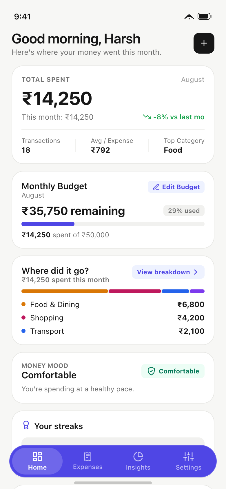

---

## 01. Project Overview

**Expenza** is a lightweight, privacy-focused mobile application designed around fast, frictionless expense recording. Built with an editorial design philosophy, high-contrast typography, and thoughtful physical ergonomics, Expenza tackles the primary failure mode of personal finance apps: *friction-induced abandonment*.

At the heart of Expenza is its signature **Shake-to-Add** interaction. Rather than navigating deep menu hierarchies or hunting for floating action buttons while on the go, users can simply shake their device immediately after making a purchase to trigger an optimized quick-add modal. Complemented by real-time budget tracking, visual categorical distribution ("Where did it go?"), deterministic behavioral analytics ("Money Mood" and "Streaks"), and native report export workflows, Expenza bridges the gap between fast capture and meaningful financial reflection.

---

## 02. Project Summary

| Dimension | Details |
|---|---|
| **Project Type** | Mobile Application (iOS & Android) |
| **Role** | Product Designer & Frontend/Mobile Architect |
| **Duration** | 6 Weeks (Concept to Production) |
| **Platform** | React Native / Expo (Bare Native Modules + Expo SDK 52) |
| **Design Language** | Editorial Minimalist Light Theme (Warm Neutrals, High-Contrast Typography, Glassmorphism Navigation) |
| **Core Differentiator** | Sensor-based Shake-to-Add Expense capture with background fallback |
| **Data Philosophy** | 100% Local-First & On-Device Storage (`AsyncStorage` + Native Bridge) |
| **Key Output Assets** | Multi-format reports (Styled Excel `.xlsx`, Base64 Native PDF `.pdf`, Structured JSON `.json`) |

---

## 03. Problem Statement

Most mobile expense tracking applications fail not due to a lack of features, but because of excessive interaction friction. 

```text
Traditional Expense Capture Workflow:
[Unlock Phone] → [Find & Launch App] → [Wait for Splash/Feed] → [Locate Floating Button] → [Tap Category Dropdown] → [Navigate Submenus] → [Enter Amount via Generic Keypad] → [Tap Save]
Result: High friction, forgotten transactions, fragmented tracking.
```

### Key User Pain Points

1. **High Capture Overhead at Point of Sale:** When walking away from a coffee counter or grocery checkout, users have less than 5 seconds of active attention to record an expense before pocketing their phone.
2. **Cognitive Overload in Budgeting:** Overly complex charts, pie-chart clutter, and manual account reconciliation overwhelm casual users seeking simple day-to-day spending clarity.
3. **Privacy Concerns:** Modern users are increasingly hesitant to link personal bank credentials or store sensitive transaction receipts in third-party cloud servers.
4. **Disconnection Between Tracking and Behavioral Change:** Most apps report numbers passively without explaining what those numbers mean in natural language or encouraging healthy habits.

```
                  ┌─────────────────────────────────────────┐
                  │          THE TRACKING DROP-OFF          │
                  │                                         │
                  │  Purchase Made → High Friction Capture  │
                  │         ↓                               │
                  │  "I'll log it later tonight" (Forgotten)│
                  │         ↓                               │
                  │  Inaccurate Totals → App Abandonment    │
                  └─────────────────────────────────────────┘
```

---

## 04. Design Goal

The core design objectives for Expenza were defined to create an experience that feels instantaneous, respectful, and aesthetically refined:

* **Sub-3-Second Expense Entry:** Reduce the number of taps and cognitive steps required to log an everyday purchase to an absolute minimum.
* **Tactile & Physical Engagement:** Leverage hardware sensors (accelerometer, haptic engine) to make financial capture feel physical, responsive, and delightful.
* **Warm Editorial Aesthetic:** Shift away from dark neon fintech cliches toward a warm, magazine-inspired, high-contrast visual system that feels calming rather than stressful.
* **Actionable Glanceability:** Provide immediate answers to fundamental daily questions: *"How much have I spent today?"*, *"How much budget do I have left?"*, and *"Where did my money go?"*
* **Complete Privacy Assurance:** Store 100% of financial data locally on the user's device with zero telemetry, accounts, or cloud dependencies.

---

## 05. Target Users

Expenza is crafted for individuals who value speed, simplicity, and design craftsmanship:

```
  ┌───────────────────────────────┐     ┌───────────────────────────────┐
  │      The Busy Commuter        │     │     The Mindful Spender       │
  │ • Makes 3–6 micro-purchases/d │     │ • Wants clarity over budget   │
  │ • Needs instant single-handed │     │ • Motivated by no-spend days  │
  │   capture on the move         │     │   and consistency streaks     │
  │ • Hates complex submenus      │     │ • Appreciates plain English   │
  │                               │     │   spending explanations       │
  └───────────────────────────────┘     └───────────────────────────────┘
  ┌───────────────────────────────┐     ┌───────────────────────────────┐
  │     The Privacy Advocate      │     │    The Design Enthusiast      │
  │ • Refuses third-party banking │     │ • Values micro-interactions,  │
  │   sync & cloud storage        │     │   typography, and tactile     │
  │ • Demands raw local data      │     │   haptic feedback             │
  │   export (Excel, PDF, JSON)   │     │ • Dislikes noisy dashboard    │
  │                               │     │   clutter                     │
  └───────────────────────────────┘     └───────────────────────────────┘
```

---

## 06. UX Challenges

Designing an ultra-lightweight financial tool presented unique ergonomic and technical challenges:

1. **Accidental Shake Prevention:** Accelerometers in mobile phones experience constant micro-movements during walking, running, or pocket retrieval. The system needed sophisticated threshold filtering and sensitivity tuning.
2. **Foreground vs. Background OS Sandboxing:** Mobile operating systems (iOS and Android) aggressively restrict background accelerometer listening to preserve battery life. The UX had to seamlessly handle both active in-app triggers and native background notification fallbacks.
3. **Data Entry Speed vs. Categorical Accuracy:** Balancing quick one-tap inputs with rich categorization without cluttering the screen with multi-level dropdowns.
4. **Information Hierarchy on Small Screens:** Presenting budget progress, hero balance, categorical distribution, mood analysis, and streak tracking in a coherent, non-overwhelming single dashboard flow.

---

## 07. Product Strategy

Expenza's product strategy is built on three foundational pillars:

```
                    ┌──────────────────────────────┐
                    │       EXPENZA TRIAD          │
                    └──────────────┬───────────────┘
                                   │
         ┌─────────────────────────┼─────────────────────────┐
         ▼                         ▼                         ▼
┌───────────────────┐    ┌───────────────────┐    ┌───────────────────┐
│   ZERO FRICTION   │    │  EDITORIAL CLARITY│    │  LOCAL SOVEREIGNTY│
│  Shake detection, │    │  Clean typography,│    │  100% on-device,  │
│  quick-increment  │    │  warm light theme,│    │  zero cloud sync, │
│  pills, haptics   │    │  plain-text recap │    │  pro Excel/PDF    │
└───────────────────┘    └───────────────────┘    └───────────────────┘
```

---

## 08. Core Product Idea

The breakthrough interaction in Expenza is replacing UI navigation with physical intent. When a user buys a coffee, their phone is already in hand. A subtle, natural flick of the wrist immediately presents a streamlined expense form with the keyboard focused, category defaulted to recent context, and quick-increment amount chips readily available.

```
Physical Shake Gesture ──► Hardware Accelerometer ──► Debounce & Threshold Filter ──► Tactile Haptic Pulse ──► Instant Expense Modal
```

---

## 09. Information Architecture

The application is structured into four primary tab destinations, complemented by global contextual overlays and a dedicated onboarding sequence:

```
Expenza Application
│
├── Onboarding Flow (5-Step Setup)
│   ├── 01. Welcome & Value Proposition
│   ├── 02. Personalization (User Name)
│   ├── 03. Currency Selection (8 Global Currencies)
│   ├── 04. System Permissions (Notifications & Motion Sensors)
│   └── 05. Shake Sensitivity Tuning (Low / Medium / High)
│
├── 01. Home Tab (Primary Dashboard)
│   ├── Hero Balance Card (Total spent, monthly total, month-over-month trend, mini metrics)
│   ├── Monthly Budget Card (Remaining amount, % used progress bar, target limit)
│   ├── Where Did It Go? Widget (Live multi-segment horizontal bar, top 3 categories)
│   ├── Money Mood Card (Deterministic spending pace badge & status text)
│   ├── Streaks Card (Under-budget, no-spending, and tracking streak counters)
│   └── Quick Action Card (Shake tutorial & manual Add Expense trigger)
│
├── 02. Expenses Tab (Transaction Hub)
│   ├── View Mode Switcher (List View vs. Interactive Calendar View)
│   ├── Live Search Bar (Debounced search by name, notes, or numeric amount)
│   ├── Category Filter Pills (Horizontal scrollable filter tags)
│   ├── Chronological SectionList (Date-grouped transaction cards with actions)
│   └── Interactive Calendar (Month navigator, 7x5 date grid with spending dots, day drill-down)
│
├── 03. Insights Tab (Behavioral Analytics)
│   ├── Money Replay Banner (Interactive 7-card monthly story recap)
│   ├── Money Mood Analysis Card (Real-time spending velocity evaluation)
│   ├── Spending Breakdown Bar Chart (4-month comparative spending trend)
│   ├── Category Distribution Widget (Multi-segment bar & active category rankings)
│   └── "Explain My Month" Callout (Plain English editorial spending summary)
│
├── 04. Settings Tab (Preferences & Data Sovereignty)
│   ├── Preferences (Name, Currency selector, Shake toggle, Sensitivity selector, Budget, Haptics)
│   ├── Expense Reminders (Daily reminder toggle, Custom 24h/12h Time Picker, Home Widget guide)
│   ├── Data & Storage (Multi-format export modal, Erase all data confirmation)
│   └── About (Brand mark, Version 1.0.0 info, Local storage privacy pledge)
│
└── Global Modals & Overlays
    ├── Quick Expense Modal (Add & Edit modes, 3x3 category grid, amount presets)
    ├── Where Did It Go? Full Drill-Down Modal (Category breakdown with transaction inspection)
    ├── Set Monthly Budget Modal (Numeric input + quick preset chips)
    ├── Custom Mobile Time Picker Modal (12h/24h dial grid with minute stepper)
    ├── Export Format Modal (Excel .xlsx, PDF statement, JSON backup)
    └── Confirmation Dialogs (Destructive delete & erase confirmation modals)
```

---

## 10. User Flow

```
[User Action] ──────────► [Application Response] ──────────► [Outcome]

   Shake Phone ──────────► Accelerometer Detection ────────► Opens Quick Add Modal
   Tap "+ Add" ──────────► Header / Action Button ─────────► Opens Quick Add Modal
   Save Expense ─────────► AsyncStorage Save & Haptics ────► Updates Home & Analytics
   Set Budget ───────────► Calculates % Used & Pace ───────► Real-time Budget Progress Bar
   Tap Category ─────────► Filters SectionList ────────────► Targeted Expense View
   Tap Export ───────────► Generates .xlsx / .pdf / .json ─► Native OS Share Sheet
```

---

## 11. Onboarding Flow

The onboarding experience introduces users to Expenza's philosophy in five frictionless steps:

### Step 1: Welcome & Editorial Value Proposition
Introduces the aesthetic tone with the Expenza brand mark, display typography, and a geometric transaction mockup.

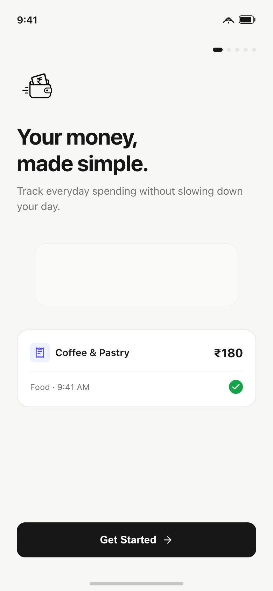

### Step 2: Personalization
Captures the user's name to personalize headers and greeting states throughout the app.

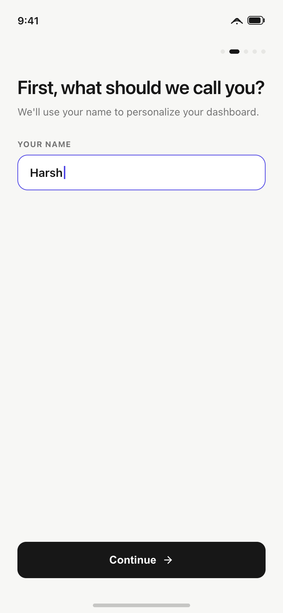

### Step 3: Currency Configuration
Enables users to select their active currency from supported global currencies (INR `₹`, USD `$`, EUR `€`, GBP `£`, AED `د.إ`, JPY `¥`, CAD `CA$`, AUD `AU$`).

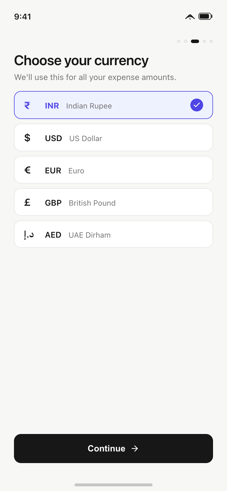

### Step 4: System Permissions
Clearly explains why Expenza requests Notifications and Motion Sensors, showcasing real-time permission status badges with deep links to OS Settings if denied.

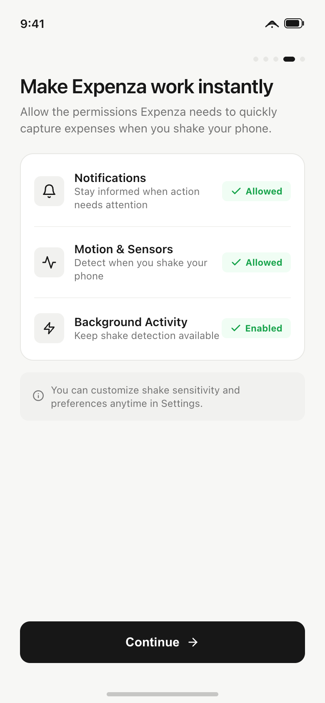

### Step 5: Shake Sensitivity Calibration
Allows users to configure their preferred accelerometer sensitivity (Low, Medium, High) with an explicit recommendation to start on Low to prevent accidental triggers.

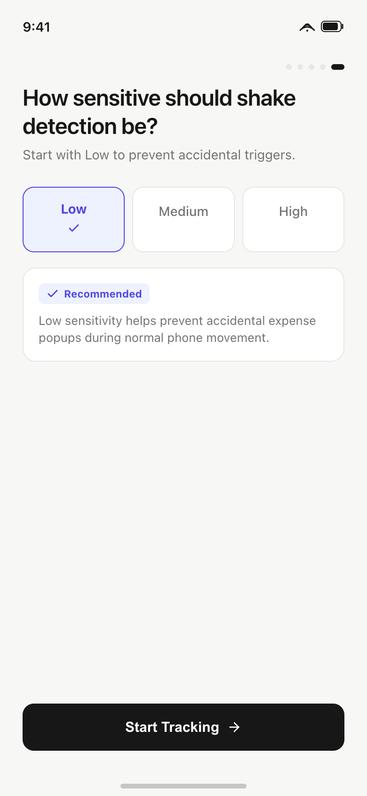

---

## 12. Add Expense Flow

The Add Expense interaction is engineered for lightning-fast entry:

```
[Shake or Tap Add] ──► [Auto-focused Input] ──► [Tap Category] ──► [Tap Amount Pill] ──► [Save]
```

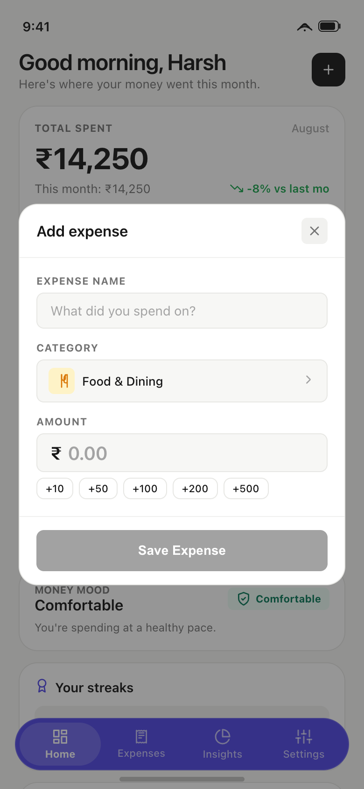

### Key Interaction Details
* **Immediate Focus:** Auto-focuses the expense name input upon modal entrance.
* **3x3 Category Grid:** Expands a compact, color-coded grid with high-contrast icons for immediate category selection.
* **Quick Amount Increments:** Provides `+10`, `+50`, `+100`, `+200`, and `+500` one-tap modifier pills to rapidly build common transaction amounts without typing.
* **Live Validation:** Validates both title presence and positive numeric values with clear error feedback.

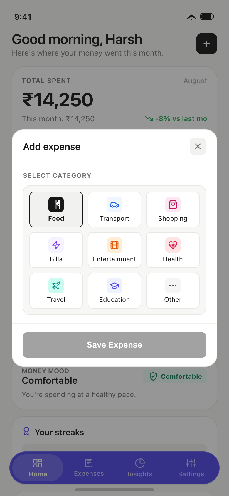
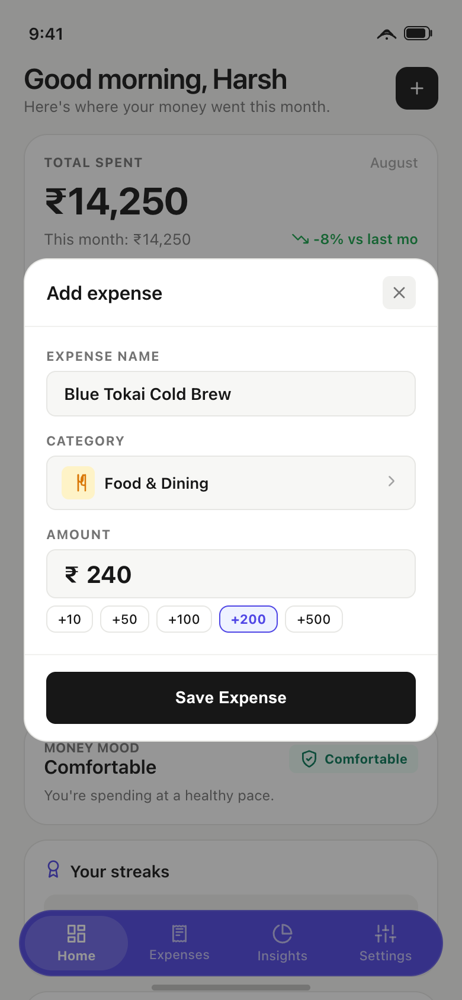
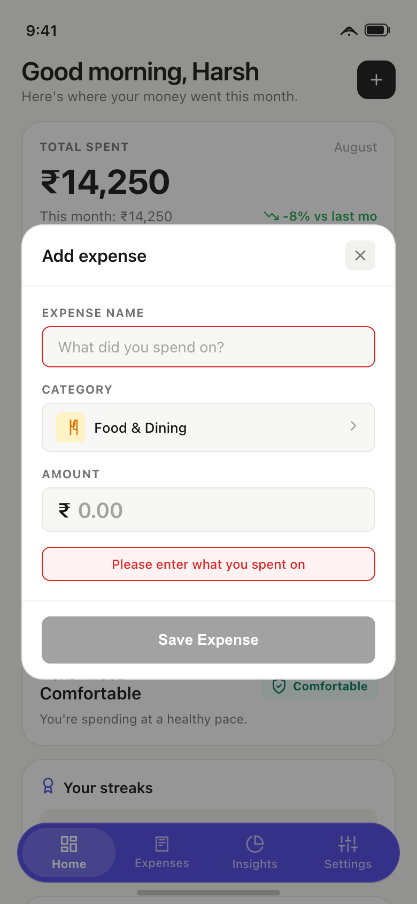

---

## 13. Shake-to-Add Experience

The shake feature is Expenza's signature UX differentiator. It transforms an otherwise mundane administrative task into a physical, responsive reflex.

```
                               ┌─────────────────────────────┐
                               │  PHYSICAL SHAKE DETECTED    │
                               └──────────────┬──────────────┘
                                              │
                      ┌───────────────────────┴───────────────────────┐
                      ▼                                               ▼
         [App State: FOREGROUND]                             [App State: BACKGROUND]
                      │                                               │
             Haptic Notification Pulse                       Haptic Feedback
                      │                                               │
             Direct Modal Display                            System Notification
          (QuickExpenseModal rendered)                    ("Quick Add Expense · Tap to Log")
                      │                                               │
               Immediate Entry                               Deep Link into Quick Add Modal
```

### Technical Specification
* **Sensor Sampling Rate:** `50ms` polling interval via hardware Accelerometer.
* **Delta Acceleration Algorithm:** Computes combined coordinate delta `Δ = |x - x_prev| + |y - y_prev| + |z - z_prev|`.
* **Sensitivity Thresholds:**
  * **Low (Recommended):** `Δ > 3.0G` (Prevents walking/pocket false positives)
  * **Medium:** `Δ > 2.2G` (Balanced active use)
  * **High:** `Δ > 1.5G` (Ultra-sensitive desktop desk tap)
* **Debounce Window:** `1,500ms` cooldown timer to prevent multiple triggers from a single shake action.
* **Background Foreground Service:** Native Android Foreground Service bridge maintains sensor vigilance and dispatches deep-link notifications when the app is minimized.

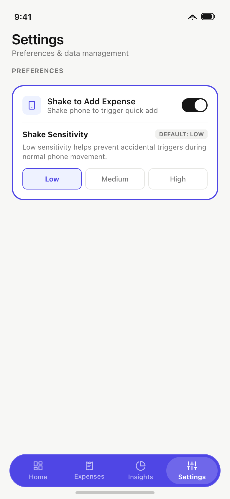
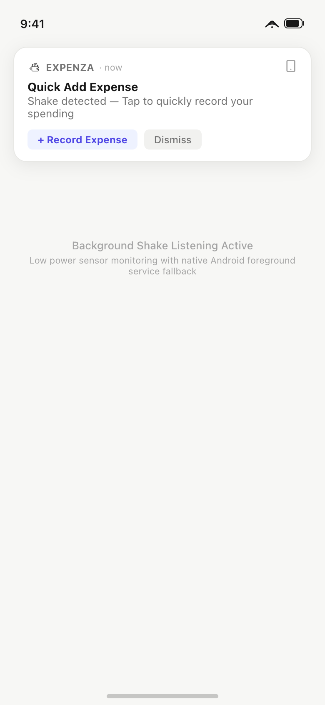

---

## 14. Home Experience

The Home Screen serves as the central command center for everyday financial awareness:


### Core Components
1. **Editorial Header:** Displays time-contextual greetings (*"Good morning, Harsh"*) and quick add action.
2. **Hero Balance Card:** Prominently highlights total spent, monthly spent, month-over-month percentage delta, transaction count, average expense, and leading category.
3. **Monthly Budget Widget:** Displays remaining funds, percentage used, and a multi-state progress bar (Healthy Indigo, Warning Amber at >80%, Danger Red when exceeded).
4. **Where Did It Go? Category Bar:** A segmented horizontal bar mapping spending proportions across categories.
5. **Money Mood Card:** Deterministically evaluates current spending velocity against the monthly timeline.
6. **Streaks Card:** Rewards positive behavioral consistency (Under-Budget, No-Spend, and Tracking streaks).
7. **Shake Action Helper:** Educates users on the shake gesture while offering a manual fallback.

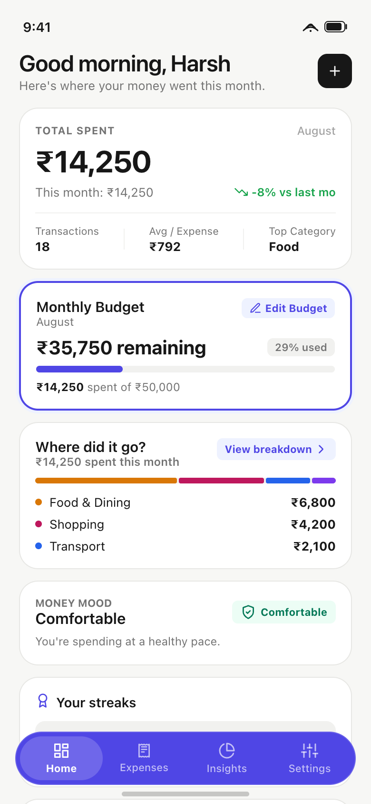
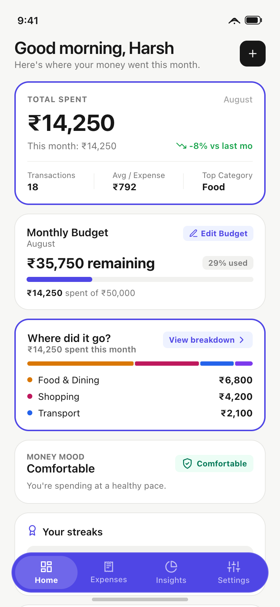


---

## 15. Expenses Experience

The Expenses Screen provides comprehensive transaction management across two viewing paradigms:

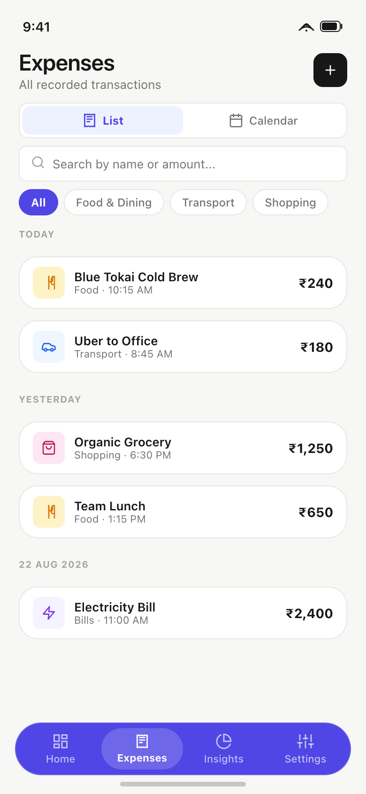

### 1. Chronological List View
* **Date Grouping:** Automatically groups transactions into `TODAY`, `YESTERDAY`, and specific date sections.
* **Debounced Search:** Instant full-text search across titles, amounts, and notes.
* **Category Filter Pills:** One-tap filtering with active indicator tags.
* **Item Actions:** Tap to edit pre-filled modal, swipe/tap to trigger delete confirmation.


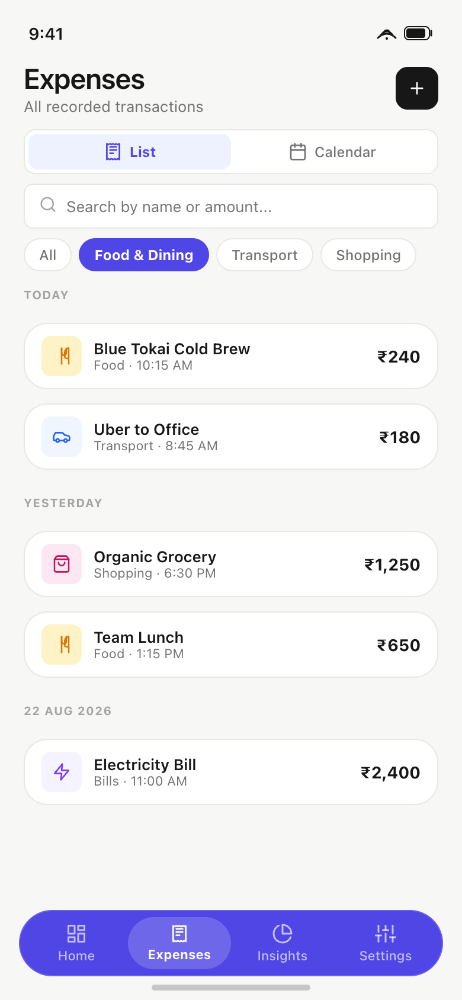

### 2. Interactive Calendar View
* **Monthly Navigator:** Seamless previous/next month browsing.
* **Spending Indicator Dots:** Visual dot markers highlighting active spending days.
* **Day Inspection Card:** Selecting any day reveals that day's total spend, full transaction list, and quick add button.

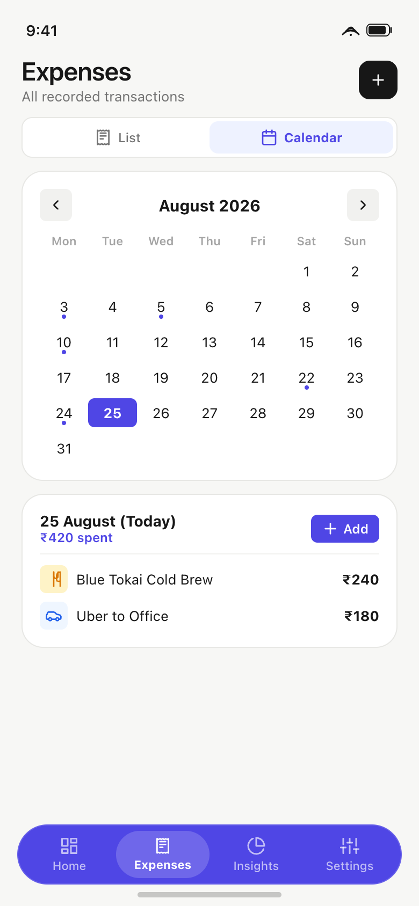
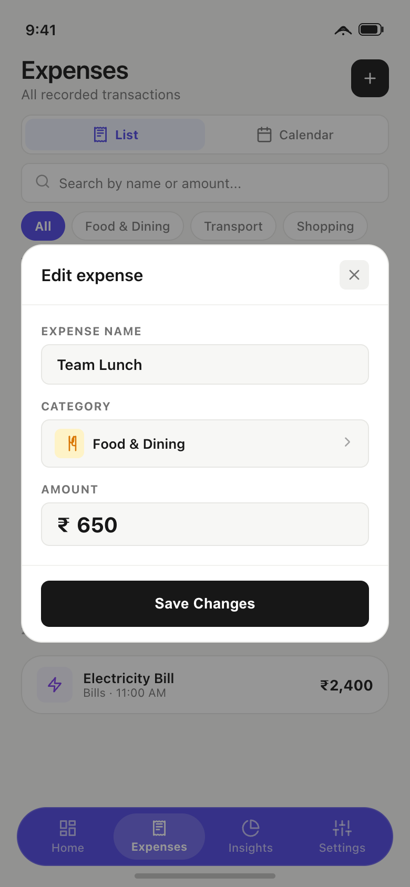
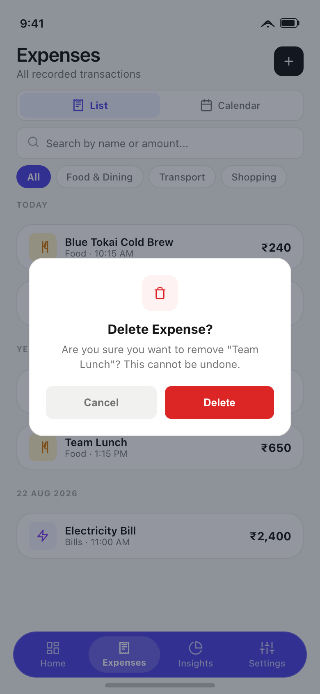

---

## 16. Insights Experience

The Insights Screen translates raw numbers into actionable behavioral understanding:

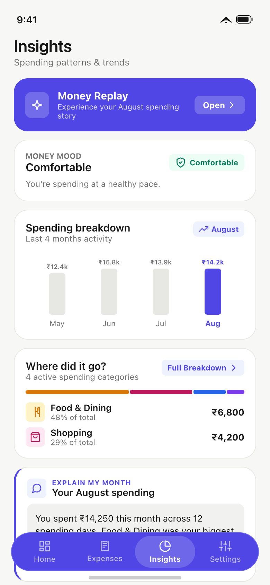

### Key Features
* **Money Replay:** An interactive, story-format monthly recap inspired by social media stories, walking users through total spent, top category, spending days, no-spend days, biggest purchase, and budget health.
* **Spending Breakdown Chart:** A 4-month historical bar chart comparing current spending against previous months.
* **"Explain My Month" Callout:** A deterministic natural-language generator that creates an editorial narrative describing monthly spending habits in plain English.
* **Where Did It Go? Full Drill-Down:** An expandable breakdown modal allowing users to inspect exact transactions within any category.

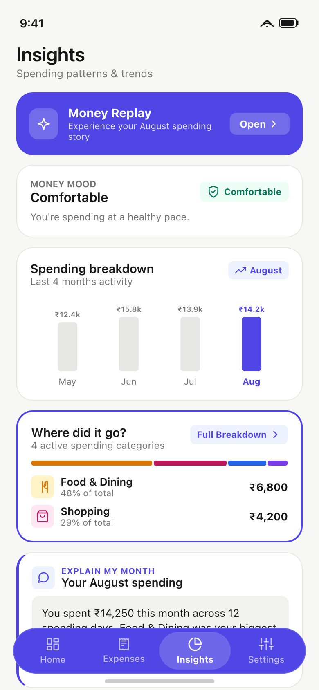
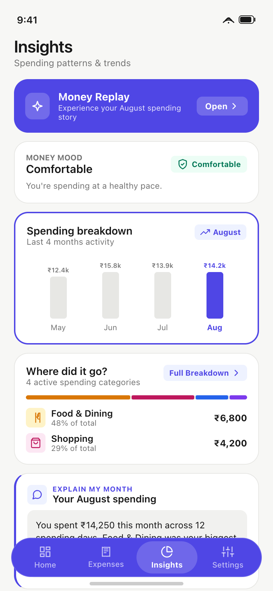
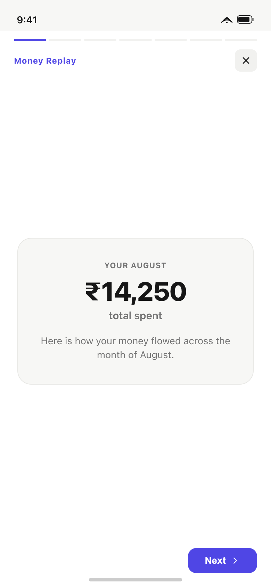
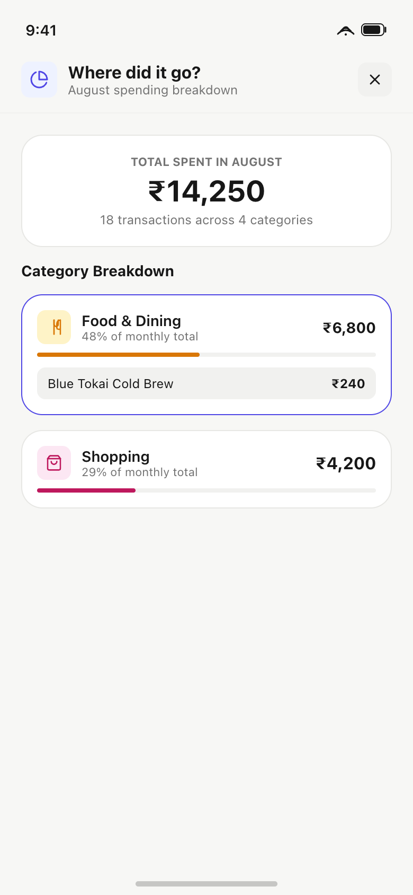

---

## 17. Settings Experience

The Settings Screen provides granular control over user preferences and data management:

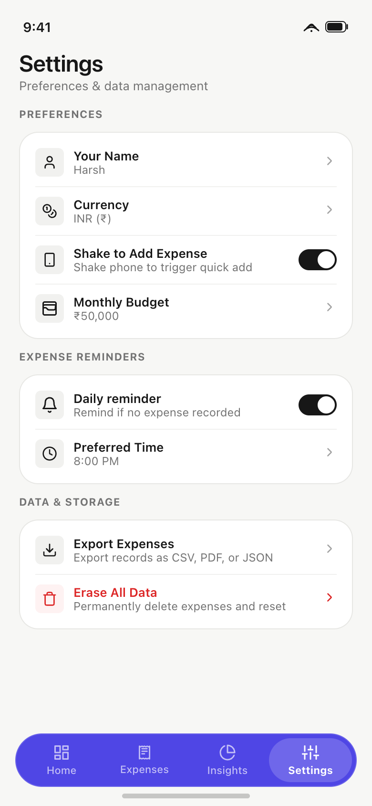

* **User Name & Currency:** Quick editing of profile name and currency symbol.
* **Shake Configuration:** Toggle shake detection and adjust sensitivity thresholds.
* **Monthly Budget Setup:** Define monthly spending limits with one-tap preset chips.
* **Daily Reminders:** Enable scheduled notifications if no expense has been recorded by a custom hour.
* **Custom Time Picker:** An ergonomic dial and minute stepper interface for setting reminder times.
* **Home Screen Widget Guide:** Visual tutorial for adding the native Android AppWidget to the device launcher.
* **Data Sovereignty:** Native export engine and permanent data reset actions.

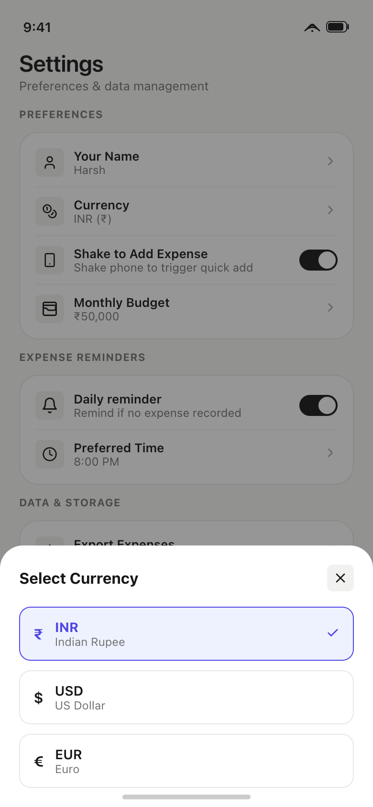
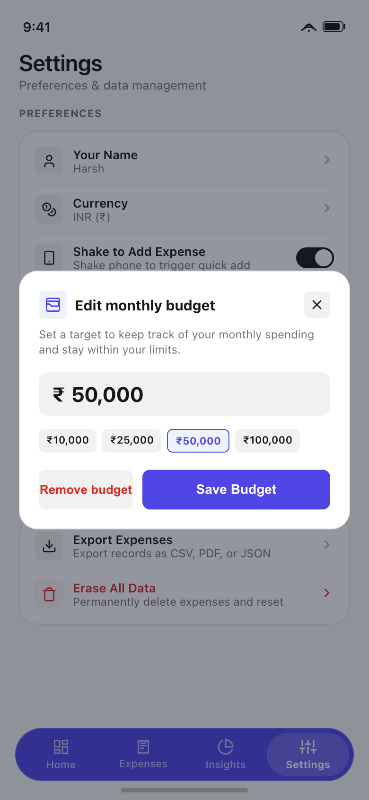
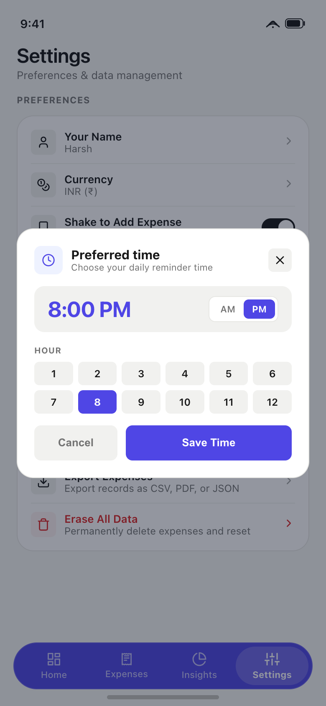
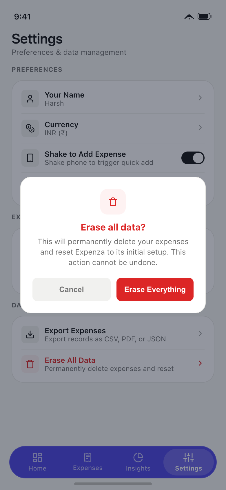

---

## 18. Export Experience

Expenza treats data portability as a first-class feature rather than an afterthought. Users can generate and share professionally styled financial documents directly from the app:

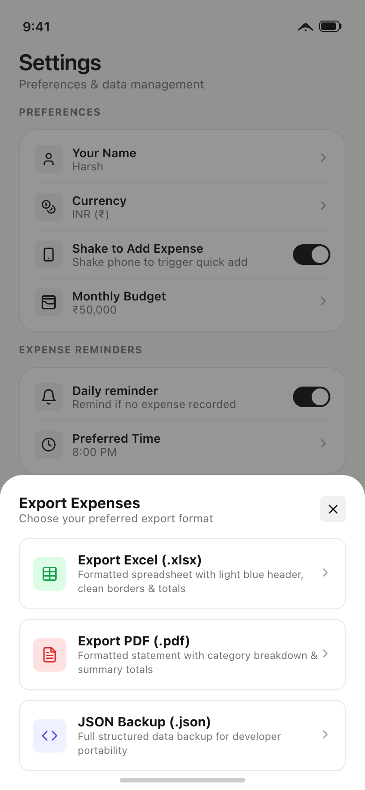

```
                            ┌──────────────────────────────┐
                            │    LOCAL EXPENSE DATASET     │
                            └──────────────┬───────────────┘
                                           │
         ┌─────────────────────────────────┼─────────────────────────────────┐
         ▼                                 ▼                                 ▼
┌──────────────────┐              ┌──────────────────┐              ┌──────────────────┐
│  EXCEL (.XLSX)   │              │   PDF STATEMENT  │              │   JSON BACKUP    │
│ Styled headers,  │              │ Formatted A4,    │              │ Full structured  │
│ borders, formulas│              │ summary cards,   │              │ schema for dev   │
│ & totals via     │              │ category table   │              │ portability      │
│ xlsx-js-style    │              │ via Expo Print   │              │                  │
└────────┬─────────┘              └────────┬─────────┘              └────────┬─────────┘
         │                                 │                                 │
         └─────────────────────────────────┼─────────────────────────────────┘
                                           ▼
                            ┌──────────────────────────────┐
                            │    NATIVE OS SHARE SHEET     │
                            │  AirDrop, Drive, WhatsApp,   │
                            │  Email, Filesystem Save      │
                            └──────────────────────────────┘
```

### 1. Excel Export (`.xlsx`)
* Styled with soft blue header fills (`#D9E1F2`), dark bold headings, explicit column widths, and cell borders.
* Includes dynamic currency grouping and an accounting-style soft green summary row (`#E2EFDA`) with transaction counts.

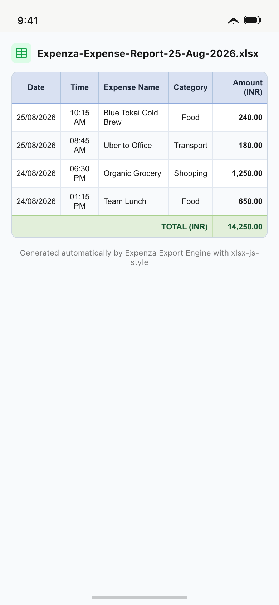

### 2. PDF Statement (`.pdf`)
* Generates an editorial A4 statement complete with header metadata, date ranges, 3-card key metrics grid, category distribution summary, and a detailed transaction table.

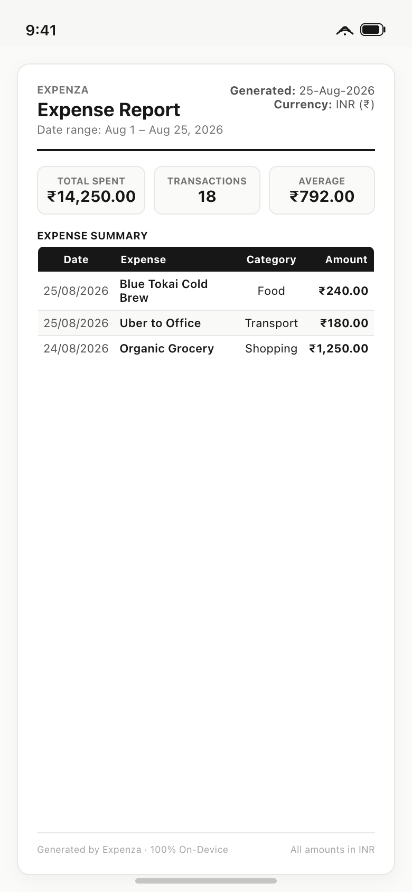
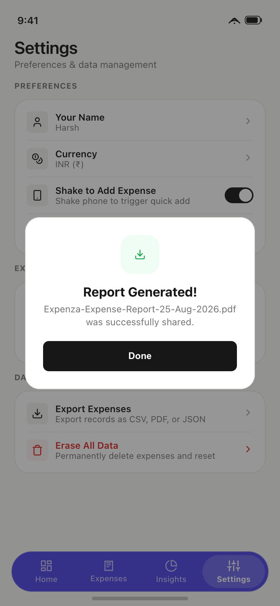

---

## 19. Edge Cases

A production-grade UX requires careful handling of empty, error, and boundary states:

| Edge Case | UX Treatment |
|---|---|
| **Zero Expenses on Launch** | Clean illustration, reassuring copy, and prominent primary "Add Expense" call-to-action. |
| **Search Query with No Matches** | Shows "No matching expenses" with a one-tap "Clear filters" reset button. |
| **Blank Form Submission** | Inline red highlight and descriptive validation banner preventing empty entries. |
| **Permission Denial** | Replaces disabled toggle with direct "Settings" button linking to system app preferences. |
| **Export with Zero Records** | Friendly modal alert preventing empty document generation. |
| **Budget Exceeded** | Smoothly transitions budget progress bar to danger red (`#DC2626`) and displays exact over-budget difference. |

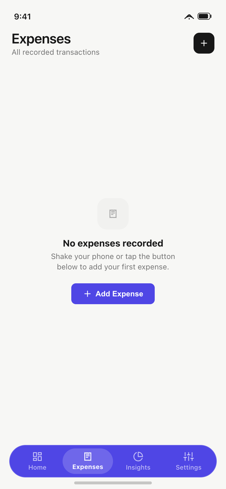
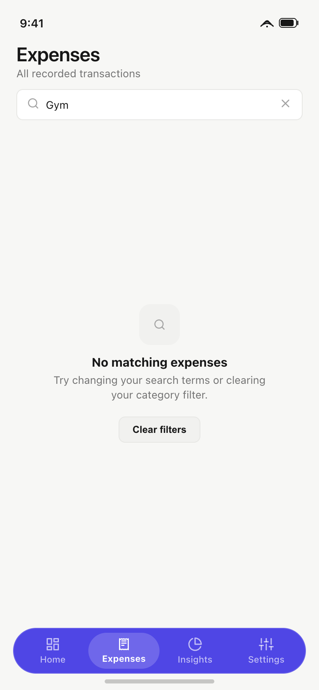
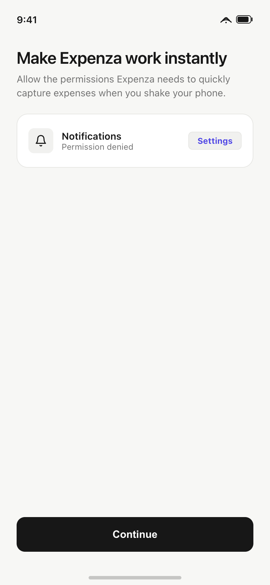
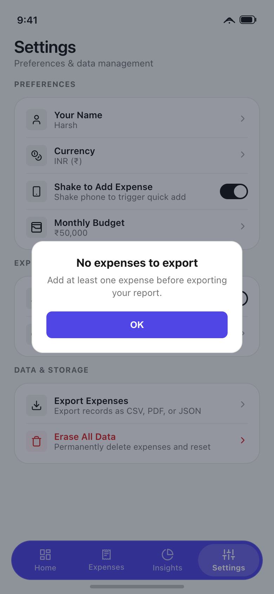

---

## 20. Design System

Expenza's visual design is grounded in a rigorous, tokenized design system built around warm neutral backgrounds, crisp white cards, 1px subtle borders, and an intentional **strict zero-drop-shadow** rule for maximum visual cleanliness.

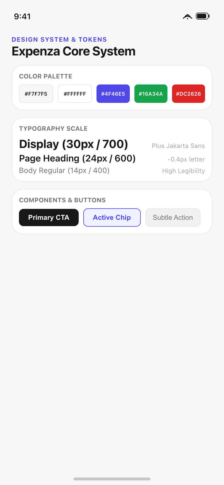

---

## 21. Typography

Expenza utilizes **Plus Jakarta Sans**, a modern geometric grotesque font engineered for high readability and numerical clarity:

| Role | Size | Weight | Letter Spacing | Purpose |
|---|---|---|---|---|
| **Amount Display** | `32px` | `700 Bold` | `-0.8px` | Hero financial balances |
| **Display Heading** | `30px` | `600 SemiBold` | `-0.6px` | Onboarding splash headlines |
| **Page Heading** | `24px` | `600 SemiBold` | `-0.4px` | Main screen titles & greetings |
| **Section Heading** | `17px` | `600 SemiBold` | `-0.2px` | Card headers & modal titles |
| **Body Large** | `15px` | `500 Medium` | `0px` | Subtitles and primary actions |
| **Body Regular** | `14px` | `400 Regular` | `0px` | Standard list items & form inputs |
| **Secondary** | `13px` | `400 Regular` | `0px` | Explanatory helper copy |
| **Caption** | `12px` | `400 / 600` | `0px` | Timestamps, tags, category labels |
| **Micro Label** | `11px` | `700 Bold` | `+0.6px` | Uppercase category & section tags |

---

## 22. Color System

The palette pairs warm neutrals with refined functional accents:

```
┌─────────────────────────────────────────────────────────────────────────────┐
│                            EXPENZA COLOR TOKENS                             │
├───────────────────┬───────────────────┬───────────────────┬─────────────────┤
│ Background        │ Surface           │ Text Primary      │ Text Secondary  │
│ #F7F7F5           │ #FFFFFF           │ #171717           │ #737373         │
│ (Warm Neutral)    │ (Crisp White)     │ (Near Black)      │ (Neutral Gray)  │
├───────────────────┼───────────────────┼───────────────────┼─────────────────┤
│ Primary Brand     │ Accent Light      │ Positive / Success│ Negative / Alert│
│ #4F46E5           │ #EEF2FF           │ #16A34A           │ #DC2626         │
│ (Indigo)          │ (Soft Lavender)   │ (Emerald Green)   │ (Crimson Red)   │
├───────────────────┼───────────────────┼───────────────────┼─────────────────┤
│ Warning / Amber   │ Border Default    │ Border Subtle     │ Modal Overlay   │
│ #D97706           │ #E7E7E4           │ #F1F1EF           │ rgba(15,23,42,  │
│ (Warm Amber)      │ (1px Neutral)     │ (Divider Hairline)│ 0.45)           │
└───────────────────┴───────────────────┴───────────────────┴─────────────────┘
```

### Category Color Palette

```
  Food & Dining       Transport           Shopping            Bills & Utilities
  Color: #D97706      Color: #2563EB      Color: #BE185D      Color: #7C3AED
  Bg:    #FEF3C7      Bg:    #EFF6FF      Bg:    #FCE7F3      Bg:    #F5F3FF

  Entertainment       Health & Medical    Travel              Education
  Color: #EA580C      Color: #E11D48      Color: #0D9488      Color: #4F46E5
  Bg:    #FFEDD5      Bg:    #FFE4E6      Bg:    #CCFBF1      Bg:    #EEF2FF
```

---

## 23. Iconography

Expenza uses a curated set of **Lucide Icons** rendered with a consistent `1.5px`–`2.0px` stroke weight and rounded joints. Icons are always paired with tinted circular or squircle containers matching their semantic category color.

---

## 24. Components

All UI elements are strictly reusable, atomic, and follow unified layout tokens:

* **Buttons:** High-contrast solid pill buttons (`#171717`), primary accent CTAs (`#4F46E5`), and subtle secondary chips (`#F1F1EF`).
* **Cards:** Bounded container cards with `20px` border radius and `1px` subtle neutral borders (`#E7E7E4`).
* **Navigation Bar:** Floating pill navigation bar anchored above the OS home indicator with translucent glassmorphism backdrop.
* **Modals & Overlays:** Centered and bottom-sheet modal sheets with smooth entrance fade and backdrop blur.
* **Progress Indicators:** Rounded track bars (`6px`–`7px` height) with smooth width interpolation.

---

## 25. UI Design Principles

1. **Minimalist & Restrained:** Avoid ornamental visual noise. Every line, badge, and number must communicate relevant information.
2. **Strictly Flat & Tactile:** Eliminate drop shadows in favor of precise 1px borders, subtle surface contrast, and rich haptics.
3. **High Information Contrast:** Crucial financial numbers (balance, remaining budget, amounts) are given dominant typographic hierarchy.
4. **Forgiving Interaction:** Accidental gestures are mitigated via debouncing, confirmation modals, and easy undo pathways.

---

## 26. Interaction Design

* **Haptic Hierarchy:**
  * *Light Impact:* Tab navigation, filter toggling, preset chip selection.
  * *Medium Impact:* Add button trigger, modal presentation.
  * *Success Notification:* Successful expense save, export completion.
  * *Warning Feedback:* Delete confirmation, validation error trigger.
* **Tap Target Sizing:** All interactive touch targets maintain a minimum dimension of `44x44pt` to adhere to Apple HIG and Google Material guidelines.

---

## 27. Motion & Animation

* **Modal Transitions:** Fast `180ms` ease-out slide and fade transitions for rapid presentation.
* **Animated Progress Bars:** Smooth React Native Animated value interpolation for budget fills and story progress.
* **Dynamic Story Progress:** Instagram-style step indicators that visually fill across the 7-stage Money Replay flow.

---

## 28. Accessibility

* **High Contrast Text:** All primary typography maintains a contrast ratio greater than `7:1` against surfaces.
* **Semantic ARIA Accessibility Roles:** Buttons, tabs, and inputs include explicit `accessibilityRole`, `accessibilityLabel`, and `accessibilityState` tags.
* **Scalable Typography:** Font scaling adapts gracefully with system text enlargement preferences.

---

## 29. Data & Storage

Expenza operates on a strictly local-first data architecture:

```
┌─────────────────────────────────────────────────────────────────────────────┐
│                          LOCAL STORAGE ARCHITECTURE                         │
├──────────────────────────┬──────────────────────────────────────────────────┤
│ Storage Engine           │ @react-native-async-storage/async-storage        │
├──────────────────────────┼──────────────────────────────────────────────────┤
│ Stored Keys              │ @expenza_expenses_v1 (Array of Expense objects)  │
│                          │ @expenza_settings_v1 (AppSettings config object) │
├──────────────────────────┼──────────────────────────────────────────────────┤
│ Data Integrity           │ Safe schema migration and default fallback on    │
│                          │ initial installation                             │
├──────────────────────────┼──────────────────────────────────────────────────┤
│ Privacy Model            │ Zero network outbound requests. Zero tracking IDs│
└──────────────────────────┴──────────────────────────────────────────────────┘
```

---

## 30. Notification Experience

* **Daily Reminders:** Scheduled local OS notifications (e.g. at 8:00 PM) prompting the user only if zero expenses have been logged that day.
* **Shake Prompt Fallback:** Background notification allowing instant entry when shake is detected while the application is minimized.
* **Actionable Deep Links:** Tapping notifications directly opens the Quick Add modal or Set Budget screen.

---

## 31. Platform Considerations

* **Android:** Leverages custom Java Native Modules for Background Sensor Monitoring and native RemoteViews AppWidget support.
* **iOS:** Adapts to strict iOS background sandbox policies by maximizing foreground accelerometer responsiveness and utilizing standard Expo APIs.

---

## 32. Key UX Decisions

```
┌──────────────────────────────────────┬──────────────────────────────────────┐
│ UX Decision                          │ Rationale                            │
├──────────────────────────────────────┼──────────────────────────────────────┤
│ Default Shake Sensitivity to "Low"   │ Eliminates false positives while     │
│                                      │ walking or carrying phone in pocket  │
├──────────────────────────────────────┼──────────────────────────────────────┤
│ Preset Amount Increment Pills        │ Speeds up entering round numbers     │
│ (+10, +50, +100, +200, +500)         │ without opening soft keyboard dial   │
├──────────────────────────────────────┼──────────────────────────────────────┤
│ Floating Glassmorphism Tab Bar       │ Maximizes vertical content area while│
│                                      │ maintaining effortless thumb access  │
├──────────────────────────────────────┼──────────────────────────────────────┤
│ "Explain My Month" Narrative         │ Replaces abstract chart reading with │
│                                      │ clear, human natural language summary│
└──────────────────────────────────────┴──────────────────────────────────────┘
```

---

## 33. Challenges & Solutions

### Challenge 1: Sensor Jitter & False Triggers
* **Problem:** Users reported that placing their phone on a table or walking caused unwanted modals to appear.
* **Solution:** Implemented 3-axis delta thresholding combined with a strict 1,500ms software cooldown debounce filter.

### Challenge 2: Excel File Formatting on Mobile
* **Problem:** Standard CSV exports opened unstyled and unformatted in mobile spreadsheet viewers.
* **Solution:** Integrated `xlsx-js-style` to construct fully styled `.xlsx` workbooks with custom header colors, bold fonts, and automated sum formulas.

---

## 34. Final Product

Expenza delivers a cohesive, fast, and satisfying personal finance experience that proves financial tracking does not need to feel like accounting homework. By marrying physical gesture capture with editorial clarity and local data sovereignty, Expenza sets a benchmark for modern, focused mobile utility design.

---

## 35. Future Improvements

Future iterations will explore expanding the core utility without compromising speed:

* **Home Screen Quick Add Widgets:** Interactive Android & iOS widgets for 1-tap logging directly from the home screen.
* **Voice Expense Recording:** On-device local speech-to-text parsing (e.g. *"Lunch 450 rupees"*).
* **Smart Recurring Bills Detection:** Automatic suggestions for recurring monthly subscriptions.
* **Encrypted Cloud Backup:** Optional end-to-end encrypted backup to user-owned iCloud Drive or Google Drive.
* **Custom Category Creation:** Allowing users to create bespoke category tags and custom color palettes.

---

## 36. Portfolio Highlights

* **Signature Shake-to-Add Gesture:** Proprietary hardware sensor interaction reducing capture time below 3 seconds.
* **Editorial Light Theme Aesthetic:** High-contrast typography and warm neutral design system.
* **Local-First Data Architecture:** 100% on-device storage with zero tracking or account mandates.
* **Rich Multi-Format Export Engine:** Professional Excel `.xlsx`, PDF statement, and JSON generation.
* **Story-Style Money Replay:** Engaging month-end visual reflection cards.
* **Deterministic Behavioral Analytics:** Plain-English spending narratives, Money Mood velocity, and consistency streak tracking.
